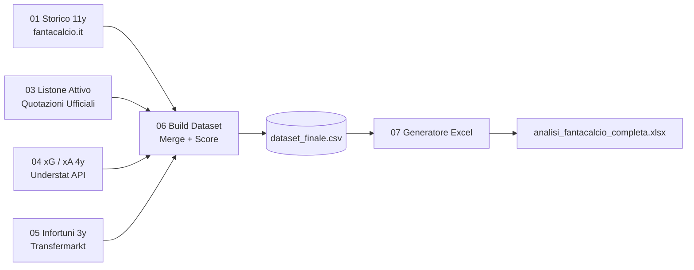

# ⚽ fanta-lab — Quantitative Fantacalcio & Serie A Analytics

[](https://www.python.org/)
[](LICENSE)
[](#-fonti-dati)
[](https://github.com/psf/black)

> **Pipeline data-driven modulare per l'analisi quantitativa, il ranking statistico e la strategia d'asta per il Fantacalcio (Classic e Mantra).**

---

## 🎯 Panoramica del Progetto

`fanta-lab` nasce per colmare il divario tra l'intuito soggettivo e l'analisi quantitativa avanzata all'asta del Fantacalcio. Integrando oltre **11 stagioni di dati storici** da `fantacalcio.it`, metriche avanzate di tiro e creazione occasioni (**xG/xA**) da `Understat`, e l'affidabilità medica/infortuni da `Transfermarkt`, il framework calcola uno **Score Composito** oggettivo e genera fogli di calcolo Excel multi-scheda pronti per guidare le decisioni all'asta in tempo reale.

Ispirato a progetti innovativi come [fantabeto](https://github.com/uPeppe/fantabeto), `fanta-lab` sposta il focus dalla predizione match-by-match alla **valutazione pre-asta globale, profilazione del rischio fisico e individuazione di target sottovalutati**.

---

## ⚖️ Confronto con Progetti Esistenti

| Dimensione | [fantabeto](https://github.com/uPeppe/fantabeto) | **fanta-lab** (questo progetto) |
|---|---|---|
| **Obiettivo Primario** | Previsione probabilità voto/fantavoto per singola giornata | **Valutazione strategica pre-asta, ranking oggettivo e risk management** |
| **Modello** | Rete Neurale Bayesiana (TensorFlow Probability, SinhArcsinh) | **Score Composito Multi-Criterio + Modello Penalità Infortuni** |
| **Fonti Dati** | fantacalcio.it, FBref | **fantacalcio.it, Understat (xG/xA), Transfermarkt (Infortuni), football-data.co.uk** |
| **Analisi Infortuni** | Non modellata esplicitamente | **Scraping multithread 3y con malus fragilità fino a -15%** |
| **Formato Output** | Notebook Jupyter con simulazione formazione | **CLI unificata + Excel multi-scheda formattato con schede per ruolo e legenda** |
| **Supporto Mantra** | Limitato | **Nativo (colonne `role_mantra` e integrazione con quotazioni)** |

---

## 🏗️ Architettura della Pipeline



Dettagli approfonditi disponibili in [docs/pipeline_architecture.md](docs/pipeline_architecture.md).

---

## 📐 Score Composito e Metodologia

Lo **Score Finale** è normalizzato nell'intervallo $[0.00, 1.00]$ e combina:

$$\text{Score} = \left( 0.20 \cdot \text{MV}_{3y} + 0.20 \cdot \text{MV}_{\text{attesa}} + 0.15 \cdot \text{FM}_{\text{attesa}} + 0.20 \cdot \text{Prob}_{\ge 8} + 0.10 \cdot \text{xG}_{3y} + 0.10 \cdot \text{Avail} + 0.05 \cdot (1 - \text{Prezzo}) \right) \times (1 - 0.15 \cdot \text{Malus}_{\text{infortuni}})$$

- **MV 3y Ponderata**: Media voto ultime 3 stagioni con pesi $3\times, 2\times, 1\times$.
- **Malus Infortuni**: Funzione dei giorni di stop totali e della presenza di infortuni gravi ($>60$ giorni).

Dettagli completi e formule matematiche in [docs/scoring_methodology.md](docs/scoring_methodology.md).

---

## 🚀 Quick Start

### 1. Clonazione e Setup Ambiente
```bash
git clone https://github.com/SpectreLabo/fanta-lab.git
cd fanta-lab

# Crea e attiva virtual environment (consigliato)
python3 -m venv venv
source venv/bin/activate

# Installa dipendenze
pip install -r requirements.txt
```

### 2. Esecuzione Pipeline

```bash
# Esegui l'intera pipeline end-to-end
python run_pipeline.py

# Oppure esegui singoli passaggi
python run_pipeline.py --step 3   # Aggiorna listone da Quotazioni
python run_pipeline.py --step 6   # Calcola Score e genera dataset finale
python run_pipeline.py --step 7   # Genera l'Excel multi-scheda
```

---

## 📊 Output Generati

1. **`data/analisi_fantacalcio_completa.xlsx`**:
   - Scheda `LISTONE COMPLETO` ordinata per Score Finale.
   - Schede dedicate per ruolo: `PORTIERI`, `DIFENSORI`, `CENTROCAMPISTI`, `ATTACCANTI`.
   - Scheda `LEGENDA COLONNE` con guida operativa all'asta.
2. **`data/dataset_finale.csv`**: Dataset strutturato a 37 colonne per analisi programmatiche.
3. **`data/storico_infortuni.csv`**: Report di fragilità fisica e giorni di stop per ogni calciatore.
4. **`examples/dataset_sample.csv`**: Campione di 55 giocatori rappresentativi per test rapidi.

---

## 📂 Struttura del Repository

```
fanta-lab/
├── config.py                          # Configurazione globale, pesi e mapping
├── run_pipeline.py                    # Entry point CLI unificato
├── requirements.txt                   # Dipendenze minime
├── LICENSE                            # Licenza MIT
├── pipeline/
│   ├── 01_scrape_historical.py        # Fase 1: Storico 11 anni fantacalcio.it
│   ├── 03_update_listone.py           # Fase 2: Lettura Quotazioni ufficiali
│   ├── 04_scrape_understat.py         # Fase 2b: Scraping xG/xA da Understat
│   ├── 05_scrape_injuries.py          # Fase 3: Scraping infortuni Transfermarkt
│   ├── 06_build_dataset.py            # Fase 4: Fuzzy Join e calcolo Score
│   └── 07_generate_excel.py           # Fase 5: Esportazione Excel multi-scheda
├── docs/
│   ├── pipeline_architecture.md       # Dettaglio tecnico del flusso dati
│   ├── scoring_methodology.md         # Formule matematiche e pesi
│   └── data_sources.md                # Descrizione fonti e logiche di scraping
├── examples/
│   └── dataset_sample.csv             # Dataset dimostrativo pronto all'uso
└── data/                              # Directory dati (generati dalla pipeline)
```

---

## 🤝 Contribuzione & Licenza

Pull request e suggerimenti per nuovi modelli o feature sono benvenuti!
Distribuito con licenza **MIT** — vedi il file [LICENSE](LICENSE) per tutti i dettagli.

*Progetto sviluppato da [SpectreLabo](https://github.com/SpectreLabo).*
