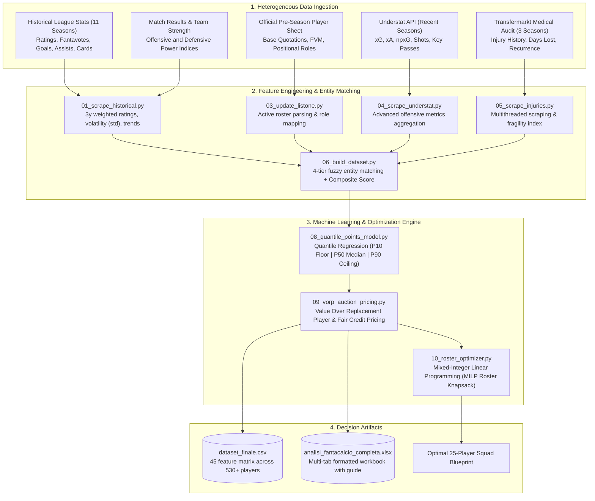
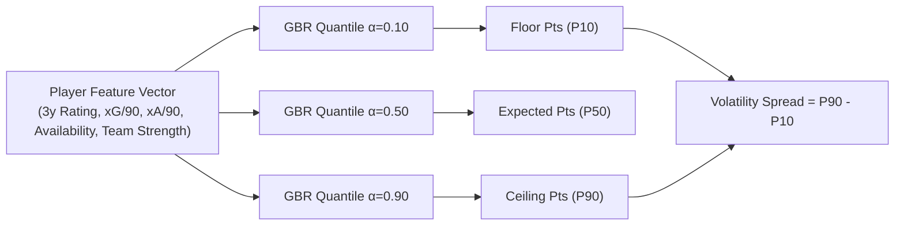
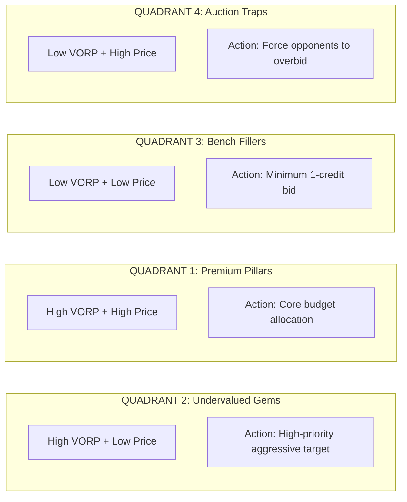

# fanta-lab — Quantitative Fantasy Football & League Analytics Framework

[](https://www.python.org/)
[](LICENSE)
[](#credits--ingestion-sources)
[](https://docs.scipy.org/doc/scipy/reference/generated/scipy.optimize.milp.html)
[](https://scikit-learn.org/)

A modular, data-driven pipeline for data extraction, probabilistic machine learning projections, sabermetric valuation (VORP), mathematical roster optimization, and modern live draft command center for fantasy football auctions (Fantacalcio Serie A).

📖 **Model Interpretability & Math Guide**: [docs/MODEL_INTERPRETABILITY.md](docs/MODEL_INTERPRETABILITY.md)  
🎮 **Live Draft Command Center Spinoff Guide**: [docs/LIVE_COMMAND_CENTER.md](docs/LIVE_COMMAND_CENTER.md)

---

## 🚀 Spinoff: Live Auction Command Center & AI Copilot (`app.py`)

While the scientific pipeline computes optimal baselines in peace, fantasy drafts happen in the chaotic reality of high-pressure bidding rooms. The **Live Command Center Spinoff** translates theoretical models into real-time execution:

- **Independent Manager Isolation**: Select your franchise with client-side `localStorage` isolation (private target wishlists, customized max credit caps, personal notes).
- **5 Dynamic Tactical Blueprints**: Real-time budget allocation (*Trazione Anteriore, Modificatore di Ferro, Centrocampo Dominante, Moneyball, Custom*) with mathematical **Stop-Loss ceilings** that adapt as players leave the board.
- **Admin-Gated Live Draft (Battitore)**: Password-protected admin engine (`ADMIN_PASSWORD` or `fanta2026`) allowing the commissioner to call, bid, and assign players with real-time budget synchronization across all participants.
- **Conversational AI Tactical Copilot**: RAG-powered chat assistant running Google **Gemini 3.5 Flash-Lite** (with zero-cost local quantitative NLP fallback) to run multi-player comparisons, squad diagnostics, and anti-panic budget audits.
- **Anti-Clutter Live Filters**: 1-click **Solo Svincolati** toggle to instantly hide drafted players, alongside assignment opacity tagging and mobile-first touch controls.

### Quickstart & Deployment
```bash
# 1. Run locally (Port 5001)
python3 app.py

# 2. (Optional) Enable Google Gemini 3.5 Flash-Lite for the AI Copilot
echo "GEMINI_API_KEY=your_key_here" > .env
```
Standard serverless cloud configuration for private hosting (Vercel, Render, Railway) is available via [`vercel.json`](vercel.json).

---

## The Problem: Why Intuition Systematically Fails at Auctions

Every pre-season, millions of fantasy managers sit around the draft table convinced that their "gut feeling" will secure the championship. The empirical results are embarrassingly predictable:
- Forty percent of the total budget is obliterated on a striker whose primary qualification was scoring a hat-trick against an alpine village team in a July friendly.
- A defender is bought at a premium price, only for the manager to realize by October that the player spends six months a year in clinical rehabilitation for chronic muscular lesions.
- An impulsive bidding war is fought over an "attacking midfielder" whose Expected Goals per 90 minutes is lower than that of the opposing goalkeeper.

`fanta-lab` was built to replace emotional hallucinations with cold, reproducible, data-driven analytics. The framework does not care about names, transfer market hype, or media narratives. Its singular purpose is to quantify the **risk-adjusted expected value** of every active player and solve the **optimal roster knapsack problem**.

---

## Core Purpose: Analytical Modules & Objectives

1. **Probabilistic Projection Engine**: Replacing static point predictions with full probability intervals (P10 Floor, P50 Expected, P90 Ceiling) to identify boom-or-bust assets vs high-floor stalwarts.
2. **Sabermetric Value Over Replacement (VORP)**: Translating projected fantasy points into mathematical, budget-constrained fair market credit bids.
3. **Mathematical 25-Player Roster Optimization**: Solving the multi-dimensional Integer Knapsack Problem (MILP) to construct the highest-expected-points squad for any given budget constraint.
4. **Anti-Hype Shield (Risk-Adjusted Pricing)**: Systematically penalizing chronically injured assets based on 3-year medical audit logs.

---

## Interactive Demo & Case Studies (Zero-Config Test)

You do not need to scrape 11 years of data to see the framework in action. Run the standalone interactive demo in one command:

```bash
python demo.py
```

### Case Study 1: The Media Hype Trap vs The Statistical Gem

Consider how the market prices a media darling vs an analytical goldmine:

| Analytical Attribute | Undervalued Gem (e.g., Krstovic / Lauriente) | Overhyped Trap (e.g., G. Ramos / Big-Name Transfer) |
|---|---|---|
| **Official List Price** | **18 credits** | **27 credits** (+50% higher) |
| **Rational Fair Price (VORP)** | **258 credits** (Elite volume) | **1 credit** (Replacement level) |
| **Market Surplus Value** | **+240 credits (Massive Bargain)** | **-26 credits (Capital Destroyer)** |
| **Expected Points (P50)** | **285.8 pts** (Ceiling: 321.7) | **49.9 pts** (Floor: 38.7) |
| **3y Injury Days Lost** | **3 days** (Clean medical audit) | **116 days** (High fragility malus) |
| **Draft Table Action** | **Primary Target (Bid Aggressively)** | **Avoid / Force Competitors to Overbid** |

### Case Study 2: Quantile Uncertainty (Boom-or-Bust vs Rock-Solid Floor)

Static averages deceive managers. Two midfielders might both project at 200 median points, but their probabilistic profiles dictate opposing roles:

- **Boom-or-Bust Match-Winner (High Volatility Spread: 130+ pts)**: High P90 ceiling (320+ pts) driven by high xG shot volume. Ideal for tournament ceiling and decisive matchday spikes.
- **Modifier Foundation Starter (Low Volatility Spread: <10 pts)**: Narrow interval between P10 and P90. Rock-solid weekly 6.5 baseline, zero rotation risk, essential for defense modifier leagues.

### Case Study 3: Live 25-Player Knapsack Solver in <0.05s

```
[SOLVER RESULT] Optimal 25-Player Squad (Budget: 500 Credits | Spend: 494 Credits)
  Projected Season Points: 5,467.3 pts (Floor: 4,094.9 pts | Ceiling: 5,935.4 pts)
  - Goalkeepers (3/3) : Svilar (19cr), Carnesecchi (17cr), Maignan (15cr)
  - Defenders   (8/8) : Dimarco (31cr), Wesley (18cr), Molina (18cr), Mancini (16cr)...
  - Midfielders (8/8) : Paz (29cr), Calhanoglu (28cr), McTominay (27cr), Da Cunha (18cr)...
  - Forwards    (6/6) : Martinez (33cr), Thuram (28cr), Yildiz (22cr), Krstovic (18cr)...
```

---

## Data Processing & ML Pipeline Architecture



---

## Machine Learning & Optimization Modules

### 1. Probabilistic Quantile Regression (`08_quantile_points_model.py`)

Static projections fail because they hide risk. A volatile forward and a steady defender might both project at 200 points, but their risk profiles are entirely different.

We train three distinct **Gradient Boosting Quantile Regressors** on over 5,000 historical player-season records:
- **P10 Floor ($\alpha=0.10$)**: Conservative worst-case scenario projection.
- **P50 Median ($\alpha=0.50$)**: Most probable expected total points outcome.
- **P90 Ceiling ($\alpha=0.90$)**: High-end breakout upside scenario.
- **Volatility Spread ($\text{P90} - \text{P10}$)**: Quantifies boom-or-bust uncertainty.



### 2. Sabermetric VORP & Fair Credit Pricing (`09_vorp_auction_pricing.py`)

A player's auction value is not their raw points, but the points they produce **above the best freely available player at their position on the waiver wire (Replacement Level)**.

1. **Positional Replacement Baseline**: The projected points of the $(N_{\text{Drafted}} + 1)$-th player at each position.
2. **Value Over Replacement Player (VORP)**:
   $$\text{VORP}_i = \max\left(0, \text{ExpectedPoints}_i - \text{Baseline}_{\text{Role}(i)}\right)$$
3. **Fair Auction Value Allocation**:
   $$\text{FairPrice}_i = 1 + \left(\text{Total League Budget} - \text{Reserve}\right) \times \frac{\text{VORP}_i}{\sum_{j} \text{VORP}_j}$$
4. **Market Surplus Value**:
   $$\text{Surplus Value} = \text{Fair Price} - \text{Official Market Price}$$

### 3. Mathematical 25-Player Roster Knapsack Optimizer (`10_roster_optimizer.py`)

We formulate roster construction as a **Mixed-Integer Linear Programming (MILP)** problem solved via `scipy.optimize.milp`:

$$\max \sum_{i=1}^{N} \text{ExpectedPoints}_i \cdot x_i$$

Subject to strict positional and budgetary constraints:
$$\sum_{i=1}^{N} \text{Price}_i \cdot x_i \le \text{Budget} \quad (\text{e.g., 500 or 1,000 credits})$$
$$\sum_{i \in \text{Goalkeepers}} x_i = 3, \quad \sum_{i \in \text{Defenders}} x_i = 8, \quad \sum_{i \in \text{Midfielders}} x_i = 8, \quad \sum_{i \in \text{Forwards}} x_i = 6$$
$$x_i \in \{0, 1\}$$

The optimizer can be run pre-draft for global blueprints or executed **live during the auction** by locking acquired players and recalculating the optimal remaining roster.

---

## Pre-Auction Decision Matrix (Value vs Price)

Cross-referencing the **Final Score** and **VORP** with the **Market Auction Price** segments every player into four operational draft quadrants:

| Score Bracket | Low Market Price / Budget Tier | High Market Price / Premium Tier |
|---|---|---|
| **High Final Score & VORP**<br/>*(Elite output & reliability)* | **QUADRANT 2 — UNDERVALUED GEMS (Primary Targets)**<br/>Players with elite underlying numbers, high availability, and strong xG undervalued by standard market pricing. This is where fantasy leagues are won. | **QUADRANT 1 — LEGITIMATE PREMIUM PILLARS**<br/>Certified top-tier players with dominant metrics and physical durability. Significant capital allocation is mathematically justified. |
| **Low Final Score & VORP**<br/>*(Mediocre metrics or high fragility)* | **QUADRANT 3 — BENCH FILLERS (Minimum Bid)**<br/>Consistent lower-tier starters or backup players to secure at base minimum price (1 credit) to complete roster requirements without burning capital. | **QUADRANT 4 — AUCTION TRAPS (Overhyped Assets)**<br/>Big-name players returning from catastrophic injuries or in tactical decline. Primary objective: drive up the price and let competitors drain their budget. |



---

## Repository Structure

```
fanta-lab/
├── config.py                          # Global configuration, scoring weights, team mappings
├── run_pipeline.py                    # Unified CLI entry point with step argument parser
├── requirements.txt                   # Minimal Python dependencies (pandas, scikit-learn, scipy)
├── LICENSE                            # MIT Open Source License
├── pipeline/
│   ├── 01_scrape_historical.py        # Stage 1: Multi-season historical data scraper
│   ├── 03_update_listone.py           # Stage 2: Official player price sheet ingestion
│   ├── 04_scrape_understat.py         # Stage 2b: Underlying xG/xA scraping
│   ├── 05_scrape_injuries.py          # Stage 3: Transfermarkt injury data scraper
│   ├── 06_build_dataset.py            # Stage 4: Fuzzy entity resolution & Scoring Engine
│   ├── 08_quantile_points_model.py    # Stage 5: Machine Learning Quantile Regression
│   ├── 09_vorp_auction_pricing.py     # Stage 6: Sabermetric VORP & Fair Credit Pricing
│   ├── 10_roster_optimizer.py         # Stage 7: Mathematical MILP 25-Player Roster Optimizer
│   └── 07_generate_excel.py           # Stage 8: Formatted multi-tab spreadsheet generator
├── docs/
│   ├── pipeline_architecture.md       # In-depth architectural dataflow documentation
│   ├── scoring_methodology.md         # Mathematical formulas and feature weights
│   └── data_sources.md                # Ingestion API specs and fallback mechanisms
├── examples/
│   └── dataset_sample.csv             # Ready-to-use 55-player sample dataset
└── data/                              # Working data directory (generated artifacts)
```

---

## Quick Start Guide

### 1. Environment Setup
```bash
git clone https://github.com/spectrelabo/fanta-lab.git
cd fanta-lab

python3 -m venv venv
source venv/bin/activate

pip install -r requirements.txt
```

### 2. Executing the Pipeline

```bash
# Execute the full end-to-end pipeline (Scraping -> Scoring -> ML -> VORP -> Optimizer -> Excel)
python run_pipeline.py

# Execute specific standalone stages
python run_pipeline.py --step 8    # Train Quantile Models (P10/P50/P90 Points)
python run_pipeline.py --step 9    # Compute VORP & Fair Credit Pricing
python run_pipeline.py --step 10   # Run MILP 25-Player Roster Knapsack Optimizer
python run_pipeline.py --step 7    # Export styled multi-tab Excel spreadsheet

# Execute from Machine Learning stages onward
python run_pipeline.py --from 8
```

---

## Generated Artifacts

1. **`data/analisi_fantacalcio_completa.xlsx`**: Styled multi-tab Excel workbook with positional sheets (Goalkeepers, Defenders, Midfielders, Forwards), ML expected points, VORP pricing, and auction strategy column legend.
2. **`data/dataset_finale.csv`**: Master 45-column dataset for downstream programmatic analysis.
3. **`data/storico_infortuni.csv`**: 3-season clinical and physical fragility audit report for all tracked players.
4. **`examples/dataset_sample.csv`**: Representative 55-player sample dataset with complete ML metrics for instant validation without scraping.

---

## Credits & Ingestion Sources

This project stands on the shoulders of the open-source football analytics community:

- **[fantabeto](https://github.com/uPeppe/fantabeto)** by [@uPeppe](https://github.com/uPeppe): Groundbreaking work applying Bayesian neural network modeling to fantasy sports performance estimation.
- **[Fantacalcio.it](http://fantacalcio.it/)**: Official ratings, historical match data, player registries, and quotations.
- **[FBref.com](http://fbref.com/)**: Standard-setting repository for European football statistics.
- **[ff_prob](https://github.com/amiles2233/ff_prob)**: Foundational inspiration for applying TensorFlow Probability to fantasy sports projections.
- **[Scrape-FBref-data](https://github.com/parth1902/Scrape-FBref-data)**: Utility for structured data extraction.
- **[Understat.com](https://understat.com/)**: Shot-level analytics, Expected Goals ($xG$), and Expected Assists ($xA$).
- **[Transfermarkt.com](https://www.transfermarkt.com/)**: Comprehensive injury logs, missed match records, and medical histories.

---

## Contributing & License

Contributions, feature proposals, and model extensions are welcome via Pull Requests and Issues.
Distributed under the **MIT License**. See [LICENSE](LICENSE) for full legal text.

Maintained by [SpectreLabo](https://github.com/spectrelabo).
