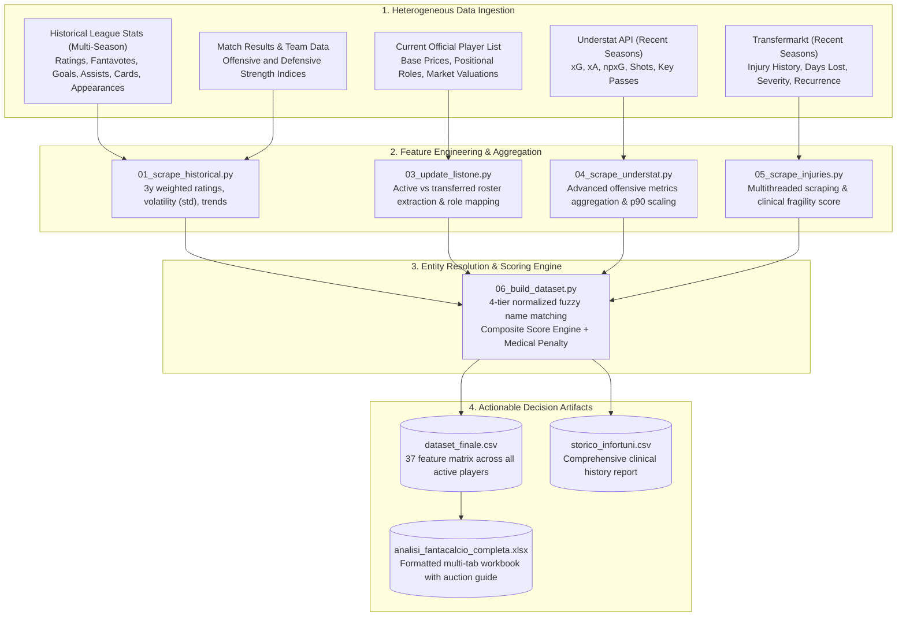
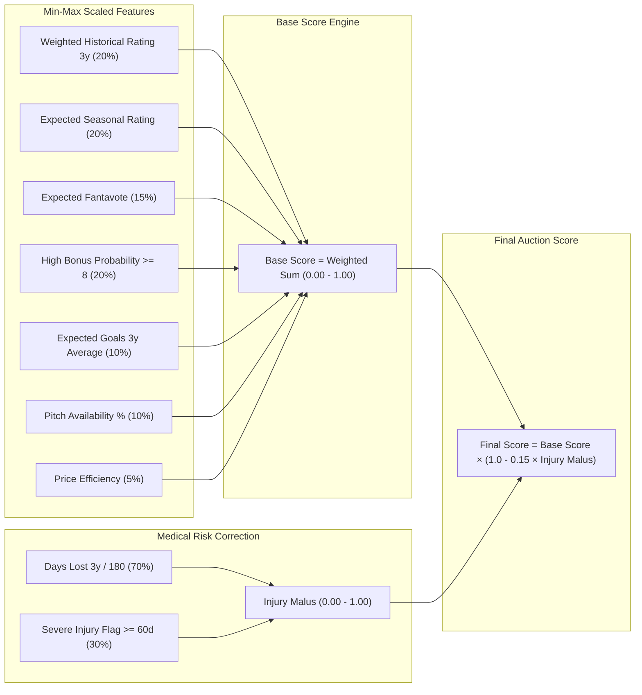
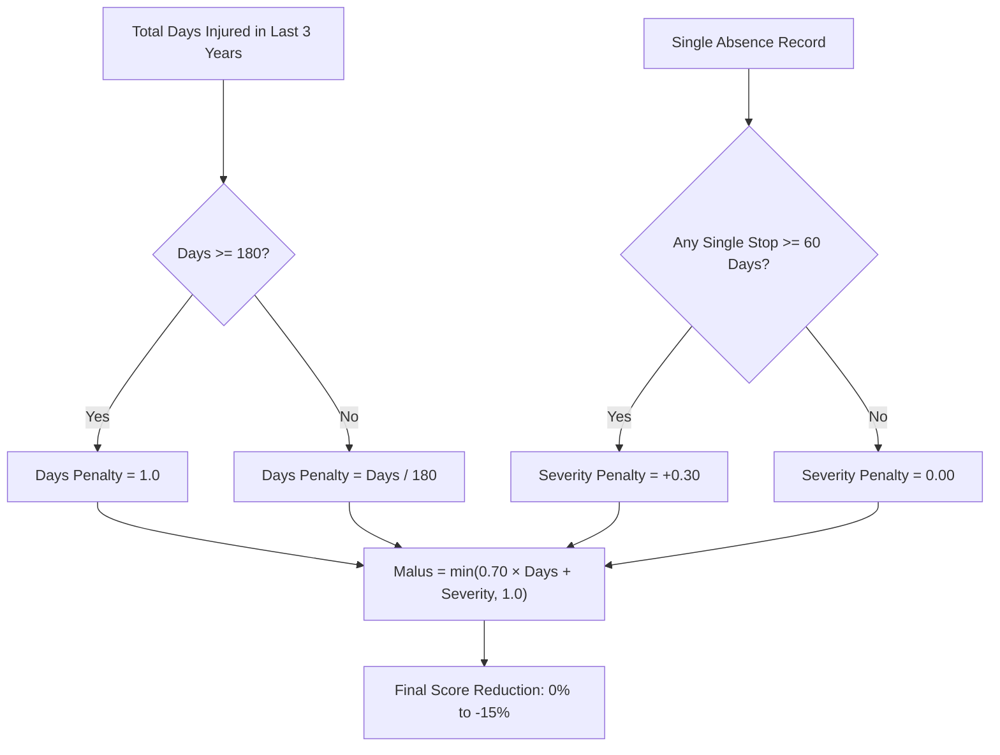
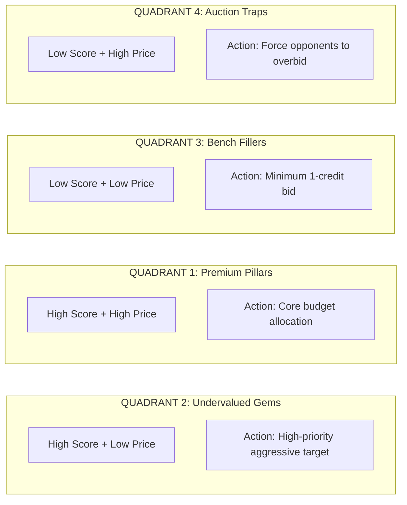

# fanta-lab — Quantitative Fantasy Football & League Analytics Framework

[](https://www.python.org/)
[](LICENSE)
[](#credits--ingestion-sources)

A modular, data-driven pipeline for data extraction, feature engineering, and quantitative risk-adjusted player ranking designed for fantasy football auctions and league drafts across any domestic competition.

---

## The Problem: Why Intuition Systematically Fails at Auctions

Every pre-season, millions of fantasy managers sit around the draft table convinced that their "gut feeling" will secure the championship. The empirical results are embarrassingly predictable:
- Forty percent of the total budget is obliterated on a striker whose primary qualification was scoring a hat-trick against an alpine village team in a July friendly.
- A defender is bought at a premium price, only for the manager to realize by October that the player spends six months a year in clinical rehabilitation for chronic muscular lesions.
- An impulsive bidding war is fought over an "attacking midfielder" whose Expected Goals per 90 minutes is lower than that of the opposing goalkeeper.

`fanta-lab` was built to replace emotional hallucinations with cold, reproducible, data-driven analytics. The framework does not care about names, transfer market hype, or media narratives. Its singular purpose is to quantify the **risk-adjusted expected value** of every active player in the league.

---

## Core Purpose: The Composite Score as an Auction Compass

The **Composite Score** is not a speculative crystal ball designed to guess next Sunday's exact scoreline. It serves as an **objective auction compass**:

1. **Market Asymmetry Detection**: Isolating players whose official price or public perception significantly undervalues their underlying performance metrics (historical ratings consistency, xG, xA, pitch availability).
2. **Anti-Hype Shield (Risk-Adjusted Pricing)**: Penalizing chronically injured or hyper-volatile players, regardless of club prestige or media fanfare.
3. **Budget Optimization & Disciplined Bidding**: Defining strict maximum rational bids to prevent managers from entering the late rounds with empty pockets.

---

## Data Processing Pipeline Architecture

The pipeline extracts, cleans, normalizes, and merges multi-source datasets through a sequential chain of autonomous Python modules.



---

## Quantitative Scoring Methodology

The final Composite Score is a normalized index in the range $[0.00, 1.00]$, generated in two stages: Base Score synthesis followed by a parametric clinical penalty.



### 1. Base Score Weight Breakdown

$$\text{Score}_{\text{base}} = \sum_{i} w_i \cdot \text{Norm}(F_i)$$

| Metric ($F_i$) | Weight ($w_i$) | Analytical Objective |
|---|---|---|
| **Weighted Historical Rating (3y)** | `0.20` | Weighted 3-season average rating with decaying weights ($3\times$ year $t-1$, $2\times$ year $t-2$, $1\times$ year $t-3$). Eliminates regression anomalies from single fluke seasons. |
| **Expected Seasonal Rating** | `0.20` | Expected baseline match rating projected for the current campaign. |
| **Expected Fantamedia** | `0.15` | Total projected fantasy average including offensive bonuses (goals, assists) and disciplinary deductions. |
| **High Bonus Probability ($\ge 8$)** | `0.20` | Probability density of registering match-winning performances ($\ge 8.0$ rating). |
| **Expected Goals ($xG$) Average (3y)** | `0.10` | Three-year volume of Underlying Expected Goals. Finishing luck regresses; shot generation volume persists. |
| **Pitch Availability %** | `0.10` | Ratio of rated appearances to total league matchdays. An elite player sitting in the stands is worth zero fantasy points. |
| **Price Efficiency** | `0.05` | $1.0 - \text{Norm}(\text{Price})$. Marginal value booster for low-cost assets with elite statistical fundamentals. |

### 2. Parametric Medical Risk Penalty

A player spending four months per season on the treatment table cannot command the same auction valuation as an ironman with identical output. The injury penalty deducts up to **15%** from the final score:

$$\text{Days Penalty} = \min\left(\frac{\text{Days Out 3y}}{180}, 1.0\right)$$

$$\text{Severity Penalty} = \begin{cases} 0.30 & \text{if } \text{Max Single Absence} \ge 60 \text{ days} \\ 0.00 & \text{otherwise} \end{cases}$$

$$\text{Injury Malus} = \min\left(0.70 \cdot \text{Days Penalty} + \text{Severity Penalty}, 1.0\right)$$

$$\text{Score}_{\text{final}} = \text{Score}_{\text{base}} \times \left(1.0 - 0.15 \cdot \text{Injury Malus}\right)$$



---

## Pre-Auction Decision Matrix (Value vs Price)

Cross-referencing the **Final Score** (risk-adjusted productivity) with the **Market Auction Price** allows managers to segment every player into four operational draft quadrants:

| Score Bracket | Low Market Price / Budget Tier | High Market Price / Premium Tier |
|---|---|---|
| **High Final Score**<br/>*(Elite performance & physical reliability)* | **QUADRANT 2 — UNDERVALUED GEMS (Primary Targets)**<br/>Players with elite underlying numbers, high availability, and strong xG undervalued by standard market pricing. This is where fantasy leagues are won. | **QUADRANT 1 — LEGITIMATE PREMIUM PILLARS**<br/>Certified top-tier players with dominant metrics and physical durability. Significant capital allocation is mathematically justified. |
| **Low Final Score**<br/>*(Mediocre metrics or high injury fragility)* | **QUADRANT 3 — BENCH FILLERS (Minimum Bid)**<br/>Consistent lower-tier starters or backup players to secure at base minimum price (1 credit) to complete roster requirements without burning capital. | **QUADRANT 4 — AUCTION TRAPS (Overhyped Assets)**<br/>Big-name players returning from catastrophic injuries or in tactical decline. Primary objective: drive up the price and let competitors drain their budget. |



---

## Repository Structure

```
fanta-lab/
├── config.py                          # Global configuration, scoring weights, team mappings
├── run_pipeline.py                    # Unified CLI entry point with step argument parser
├── requirements.txt                   # Minimal Python dependencies
├── LICENSE                            # MIT Open Source License
├── pipeline/
│   ├── 01_scrape_historical.py        # Stage 1: Multi-season historical data scraper
│   ├── 03_update_listone.py           # Stage 2: Official player price sheet ingestion
│   ├── 04_scrape_understat.py         # Stage 2b: Underlying xG/xA scraping
│   ├── 05_scrape_injuries.py          # Stage 3: Transfermarkt injury data scraper
│   ├── 06_build_dataset.py            # Stage 4: Fuzzy entity resolution & Scoring Engine
│   └── 07_generate_excel.py           # Stage 5: Formatted multi-tab spreadsheet generator
├── docs/
│   ├── pipeline_architecture.md       # In-depth architectural dataflow documentation
│   ├── scoring_methodology.md         # Mathematical formulas and feature weights
│   └── data_sources.md                # Ingestion API specs and fallback mechanisms
├── examples/
│   └── dataset_sample.csv             # Ready-to-use 55-player sample dataset
└── data/                              # Working data directory (generated artifacts)
```

---

## Quick Start Guide

### 1. Environment Setup
```bash
git clone https://github.com/spectrelabo/fanta-lab.git
cd fanta-lab

python3 -m venv venv
source venv/bin/activate

pip install -r requirements.txt
```

### 2. Executing the Pipeline

```bash
# Execute the full end-to-end pipeline
python run_pipeline.py

# Execute specific individual stages
python run_pipeline.py --step 3   # Ingest latest price sheet
python run_pipeline.py --step 6   # Compute Composite Score & generate final dataset
python run_pipeline.py --step 7   # Generate multi-tab styled Excel workbook

# Execute from a specific starting step onward
python run_pipeline.py --from 4   # From Understat scraping through Excel export
```

---

## Generated Artifacts

1. **`data/analisi_fantacalcio_completa.xlsx`**: Styled multi-tab Excel workbook with dedicated positional sheets (Goalkeepers, Defenders, Midfielders, Forwards), conditional formatting, and auction strategy column legend.
2. **`data/dataset_finale.csv`**: Master 37-column dataset for downstream programmatic analysis with pandas, Polars, or R.
3. **`data/storico_infortuni.csv`**: 3-season clinical and physical fragility audit report for all tracked players.
4. **`examples/dataset_sample.csv`**: Representative 55-player sample dataset for instant validation without scraping.

---

## Credits & Ingestion Sources

This project stands on the shoulders of the open-source football analytics community:

- **[fantabeto](https://github.com/uPeppe/fantabeto)** by [@uPeppe](https://github.com/uPeppe): Groundbreaking work applying Bayesian neural network modeling to fantasy sports performance estimation.
- **[Fantacalcio.it](http://fantacalcio.it/)**: Official ratings, historical match data, player registries, and quotations.
- **[FBref.com](http://fbref.com/)**: Standard-setting repository for European football statistics.
- **[ff_prob](https://github.com/amiles2233/ff_prob)**: Foundational inspiration for applying TensorFlow Probability to fantasy sports projections.
- **[Scrape-FBref-data](https://github.com/parth1902/Scrape-FBref-data)**: Utility for structured data extraction.
- **[Understat.com](https://understat.com/)**: Shot-level analytics, Expected Goals ($xG$), and Expected Assists ($xA$).
- **[Transfermarkt.com](https://www.transfermarkt.com/)**: Comprehensive injury logs, missed match records, and medical histories.

---

## Contributing & License

Contributions, feature proposals, and model extensions are welcome via Pull Requests and Issues.
Distributed under the **MIT License**. See [LICENSE](LICENSE) for full legal text.

Maintained by [SpectreLabo](https://github.com/spectrelabo).
