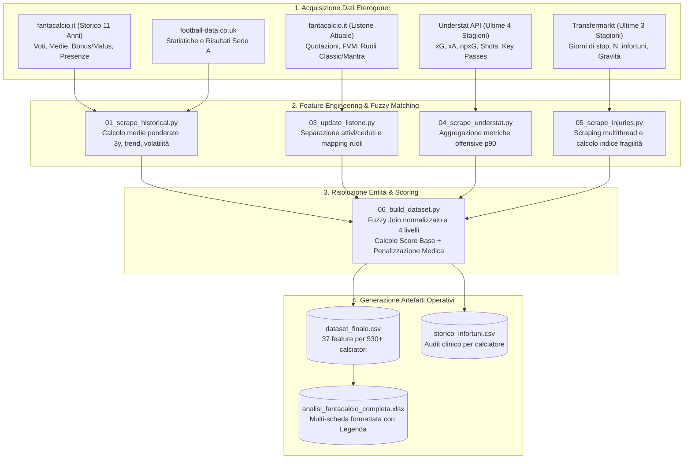
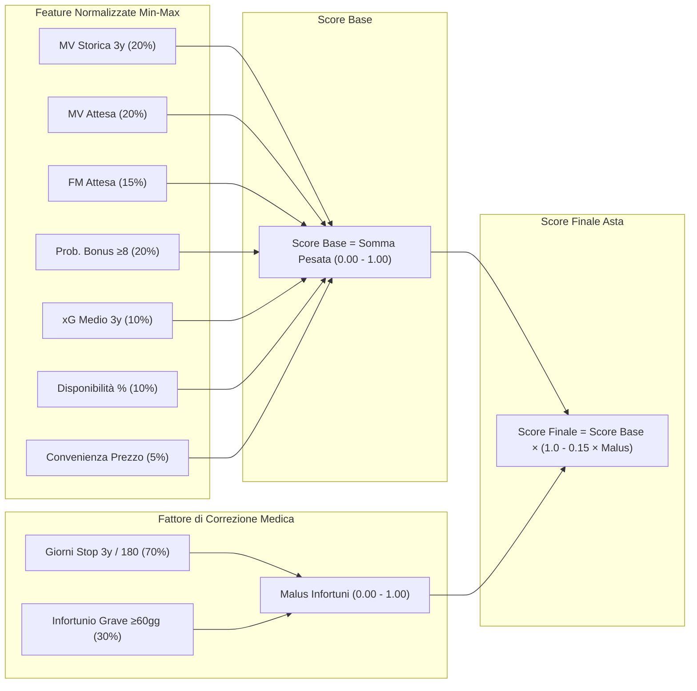
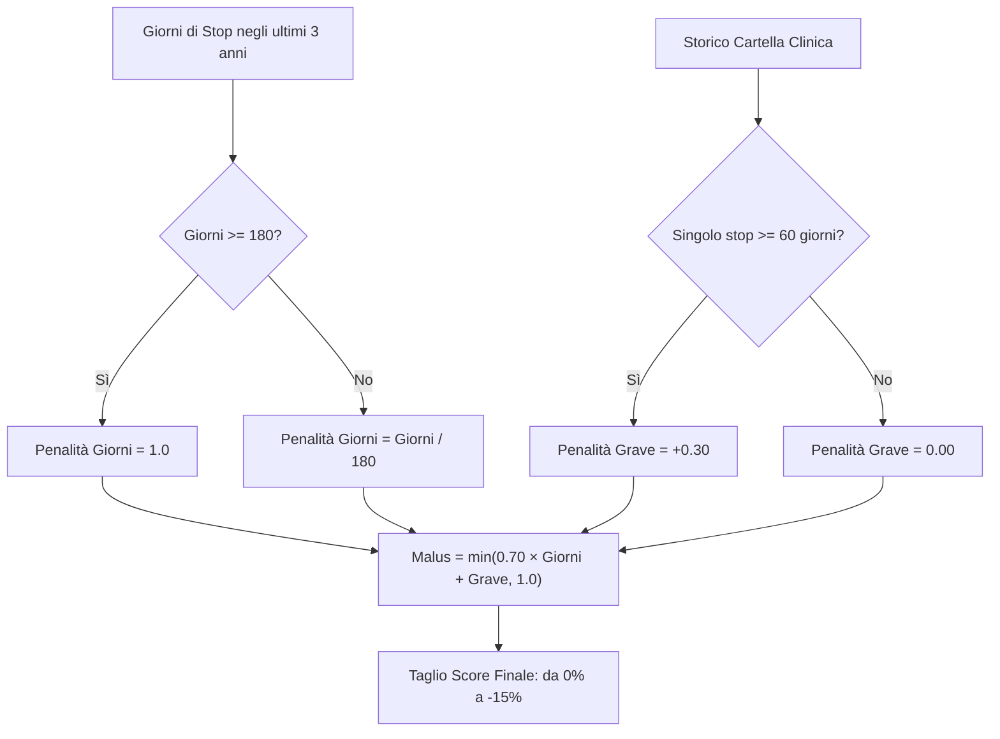
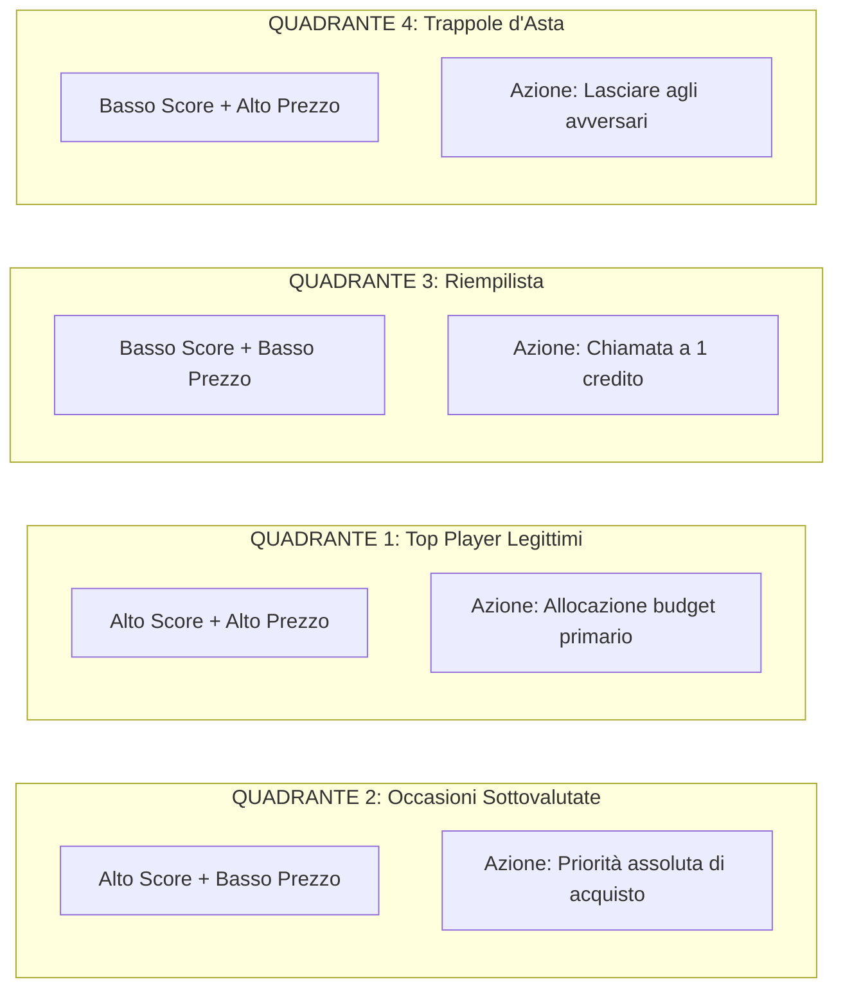

# fanta-lab — Quantitative Fantacalcio & Serie A Analytics Framework

[](https://www.python.org/)
[](LICENSE)
[](#credits--ingestion-sources)

Pipeline data-driven modulare per l'estrazione, l'ingegnerizzazione delle feature e la costruzione di un ranking quantitativo per l'asta del Fantacalcio (Classic e Mantra).

---

## Il Problema: Perché l'Intuizione all'Asta Fallisce Sistematicamente

Ogni estate, milioni di fantallenatori si siedono al tavolo dell'asta convinti che la loro "sensazione viscerale" li porterà alla vittoria. I risultati sono prevedibili:
- Il 40% del budget speso per l'attaccante che ha segnato tre gol nel precampionato contro una rappresentativa dilettanti di montagna.
- Il difensore comprato a peso d'oro per poi scoprire che passa sei mesi all'anno in clinica per problemi muscolari ricorrenti.
- L'acquisto compulsivo del centrocampista "di inserimento" che ha un Expected Goals per novanta minuti inferiore a quello del secondo portiere dell'Empoli.

`fanta-lab` nasce per sostituire le allucinazioni da bar sport con una pipeline quantitativa fredda, riproducibile e basata su dati oggettivi. Il nostro obiettivo non è dirti chi "ti piace", ma quantificare con precisione chirurgica il **valore atteso corretto per il rischio** di ogni singolo calciatore presente nel listone di Serie A.

---

## Il Nostro Obiettivo e l'Utilizzo dello Score Composito

Lo **Score Composito** non è una sfera di cristallo per indovinare chi segnerà domenica prossima. È un **compasso decisionale per l'asta**:
1. **Identificazione delle Asimmetrie di Mercato**: Trovare i calciatori che il listone ufficiale o la percezione popolare sottovalutano drammaticamente rispetto ai loro volumi di gioco storici e sottostanti (xG, xA, costanza di voto).
2. **Scudo Anti-Hype (Risk-Adjusted Pricing)**: Ridurre sistematicamente la valutazione dei calciatori clinicamente fragili o iper-volatili, indipendentemente dal blasone della squadra di appartenenza.
3. **Ottimizzazione del Budget**: Calcolare il tetto massimo di rilancio razionale per non trovarsi all'una di notte a completare il centrocampo con 4 crediti residui.

---

## Architettura della Pipeline di Elaborazione Dati

L'infrastruttura raccoglie, normalizza e fonde quattro dataset indipendenti attraverso una catena di script sequenziali.



---

## Metodologia Quantitativa dello Score

Lo Score Finale è un indice sintetico normalizzato nell'intervallo $[0.00, 1.00]$, generato in due stadi: la costruzione dello Score Base e l'abbattimento proporzionale per fragilità clinica.



### 1. Composizione Pesi dello Score Base

$$\text{Score}_{\text{base}} = \sum_{i} w_i \cdot \text{Norm}(F_i)$$

| Metrica ($F_i$) | Peso ($w_i$) | Significato Analitico |
|---|---|---|
| **MV Ponderata (3y)** | `0.20` | Media voto degli ultimi 3 anni con pesi decrescenti ($3\times$ anno $t-1$, $2\times$ anno $t-2$, $1\times$ anno $t-3$). Elimina l'illusione della singola stagione miracolosa. |
| **MV Attesa Stagionale** | `0.20` | Media voto pura proiettata dal modello per il campionato attuale. |
| **Fantamedia Attesa** | `0.15` | Fantavoto atteso complessivo (voto base + bonus da gol/assist e malus da cartellini). |
| **Probabilità Bonus $\ge 8$** | `0.20` | Frequenza stimata di prestazioni da "bonus pesante" ($\ge 8.0$). Misura l'impatto decisivo nella singola giornata. |
| **xG Medio (3y)** | `0.10` | Volume di Expected Goals medi per stagione (Understat). La fortuna nei tiri svanisce, la capacità di trovarsi al tiro rimane. |
| **Disponibilità %** | `0.10` | Rapporto tra partite a voto e 38 giornate teoriche. Il giocatore più forte del mondo è inutile se siede in tribuna 18 domeniche. |
| **Convenienza Prezzo** | `0.05` | $1.0 - \text{Norm}(\text{Prezzo})$. Piccolo bonus di efficienza per i profili low-cost con alti fondamentali. |

### 2. Modello di Abbattimento per Rischio Infortuni

Un calciatore che trascorre 200 giorni all'anno sul lettino dei massaggiatori non può avere lo stesso valore d'asta di un atleta integro con pari numeri. Il malus applica una decurtazione fino a un massimo del **15%** sullo score finale:

$$\text{Penalità}_{\text{giorni}} = \min\left(\frac{\text{Giorni Stop 3y}}{180}, 1.0\right)$$

$$\text{Penalità}_{\text{grave}} = \begin{cases} 0.30 & \text{se } \text{Max Giorni Singolo Stop} \ge 60 \\ 0.00 & \text{altrimenti} \end{cases}$$

$$\text{Malus}_{\text{infortuni}} = \min\left(0.70 \cdot \text{Penalità}_{\text{giorni}} + \text{Penalità}_{\text{grave}}, 1.0\right)$$

$$\text{Score}_{\text{finale}} = \text{Score}_{\text{base}} \times \left(1.0 - 0.15 \cdot \text{Malus}_{\text{infortuni}}\right)$$



---

## Matrice Decisionale per l'Asta (Valore vs Prezzo)

Incrociando lo **Score Finale** (rendimento atteso corretto per il rischio clinico) con il **Prezzo / Quotazione d'Asta** (aspettativa economica del mercato), ogni calciatore del listone viene segmentato in quattro quadranti operativi:

| Livello di Score | Basso Prezzo / Low Cost | Alto Prezzo / Top di Mercato |
|---|---|---|
| **Alto Score Finale**<br/>*(Rendimento e integrità elevati)* | **QUADRANTE 2 — OCCASIONI D'ORO (Target Primari)**<br/>Calciatori con metriche eccellenti, titolarità e ottimi xG sottovalutati dal listone. Qui si creano i vantaggi competitivi decisivi dell'asta. | **QUADRANTE 1 — TOP PLAYER LEGITTIMI (Pilastri)**<br/>Fuoriclasse con score dominante e comprovata affidabilità. L'investimento di una quota cospicua del budget è giustificato dai numeri. |
| **Basso Score Finale**<br/>*(Rendimento mediocre o alta fragilità)* | **QUADRANTE 3 — RIEMPILISTA (1 Credito)**<br/>Titolari di squadre minori o riserve sicure da acquisire al prezzo base (1 credito) per chiudere gli slot secondari senza disperdere risorse. | **QUADRANTE 4 — TRAPPOLE D'ASTA (Hype da Evitare)**<br/>Nomi altisonanti reduci da stagioni deludenti o con cronicità di infortuni. Giocatori da rilanciare per far spendere e impoverire gli avversari. |



---

## Confronto con fantabeto

| Dimensione | fantabeto (uPeppe) | fanta-lab (questo framework) |
|---|---|---|
| **Ambito Operativo** | Previsione probabilistica match-by-match durante la stagione | Valutazione strategica d'asta, ranking oggettivo e risk management |
| **Architettura** | Rete Neurale Bayesiana (TensorFlow Probability, SinhArcsinh) | Score Composito Multi-Criterio con penalità clinica parametrica |
| **Infortuni** | Non considerati nel calcolo | Scraping Transfermarkt multithread con audit su 3 stagioni |
| **Mantra** | Supporto limitato | Supporto nativo (integrazione ruoli Mantra e quotazioni FVM) |
| **Output** | Simulazione formazione via script/notebook | File Excel multi-scheda formattato e pronto all'uso con legenda |
| **Evoluzione Futura** | Progetto di riferimento | Valutazione di un fork per integrare simulazione bayesiana e score d'asta |

---

## Struttura del Repository

```
fanta-lab/
├── config.py                          # Configurazione globale, pesi, mapping e path
├── run_pipeline.py                    # Entry point CLI unificato con argparse
├── requirements.txt                   # Dipendenze Python minime
├── LICENSE                            # Licenza open-source MIT
├── pipeline/
│   ├── 01_scrape_historical.py        # Fase 1: Storico 11 anni fantacalcio.it
│   ├── 03_update_listone.py           # Fase 2: Parsing Quotazioni ufficiali
│   ├── 04_scrape_understat.py         # Fase 2b: Scraping xG/xA da Understat
│   ├── 05_scrape_injuries.py          # Fase 3: Scraping infortuni Transfermarkt
│   ├── 06_build_dataset.py            # Fase 4: Fuzzy Join e calcolo Score Finale
│   └── 07_generate_excel.py           # Fase 5: Esportazione Excel multi-scheda
├── docs/
│   ├── pipeline_architecture.md       # Dettaglio tecnico dei flussi dati
│   ├── scoring_methodology.md         # Formule matematiche e dimostrazioni
│   └── data_sources.md                # Specifiche API e fallback
├── examples/
│   └── dataset_sample.csv             # Campione di 55 calciatori pronto all'uso
└── data/                              # Directory artefatti generati
```

---

## Guida Rapida all'Uso

### 1. Setup dell'Ambiente
```bash
git clone https://github.com/spectrelabo/fanta-lab.git
cd fanta-lab

python3 -m venv venv
source venv/bin/activate

pip install -r requirements.txt
```

### 2. Esecuzione della Pipeline

```bash
# Esegui la pipeline completa end-to-end
python run_pipeline.py

# Esegui solo specifici passaggi
python run_pipeline.py --step 3   # Aggiornamento listone
python run_pipeline.py --step 6   # Calcolo Score e generazione dataset finale
python run_pipeline.py --step 7   # Generazione foglio Excel multi-scheda

# Esegui a partire da un determinato step
python run_pipeline.py --from 4   # Da Understat fino all'Excel finale
```

---

## Output Prodotti

1. **`data/analisi_fantacalcio_completa.xlsx`**: Foglio di calcolo con schede separate per ruolo (`PORTIERI`, `DIFENSORI`, `CENTROCAMPISTI`, `ATTACCANTI`), formattazione condizionale, colori per ruolo e scheda `LEGENDA COLONNE`.
2. **`data/dataset_finale.csv`**: Dataset master con 37 colonne per analisi avanzate con pandas, polars o R.
3. **`data/storico_infortuni.csv`**: Report della cartella clinica triennale per ogni giocatore analizzato.
4. **`examples/dataset_sample.csv`**: Estratto di test con 55 profili per validazione rapida senza scraping.

---

## Credits & Ingestion Sources

Il progetto riconosce e ringrazia le fonti e gli strumenti open-source che hanno reso possibile questo lavoro:

- **[fantabeto](https://github.com/uPeppe/fantabeto)** di [@uPeppe](https://github.com/uPeppe): Lavoro di riferimento per l'approccio scientifico al Fantacalcio. È in valutazione la realizzazione di un fork per unificare il nostro ranking d'asta con il suo motore di simulazione bayesiana.
- **[Fantacalcio.it](http://fantacalcio.it/)**: Fonte primaria per voti storici, statistiche, FVM e quotazioni.
- **[FBref.com](http://fbref.com/)**: Database di riferimento per le statistiche avanzate a livello europeo.
- **[ff_prob](https://github.com/amiles2233/ff_prob)**: Ispirazione per l'impiego di modelli probabilistici applicati al fantasy football.
- **[Scrape-FBref-data](https://github.com/parth1902/Scrape-FBref-data)**: Utilità di riferimento per l'ingestion dati da FBref.
- **[Understat.com](https://understat.com/)**: Fornitore delle metriche di tiro, Expected Goals ($xG$) ed Expected Assists ($xA$).
- **[Transfermarkt.com](https://www.transfermarkt.com/)**: Archivio medico e storico infortuni.

---

## Contribuzione e Licenza

Contributi, segnalazioni di anomalie e proposte di estensione dei modelli sono benvenuti tramite Pull Request e Issue.
Rilasciato sotto licenza **MIT**. Vedere il file [LICENSE](LICENSE) per i termini completi.

Progetto mantenuto da [SpectreLabo](https://github.com/spectrelabo).
