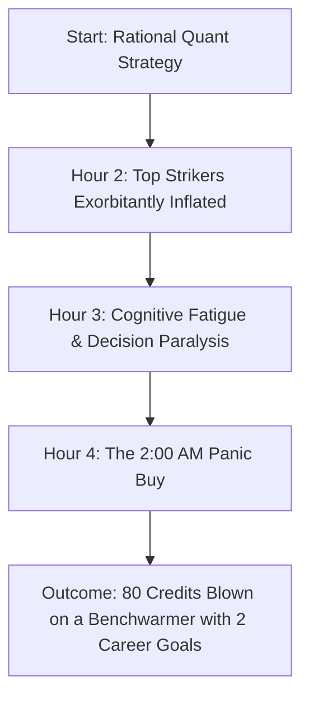
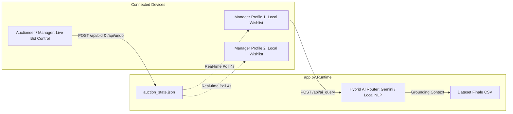
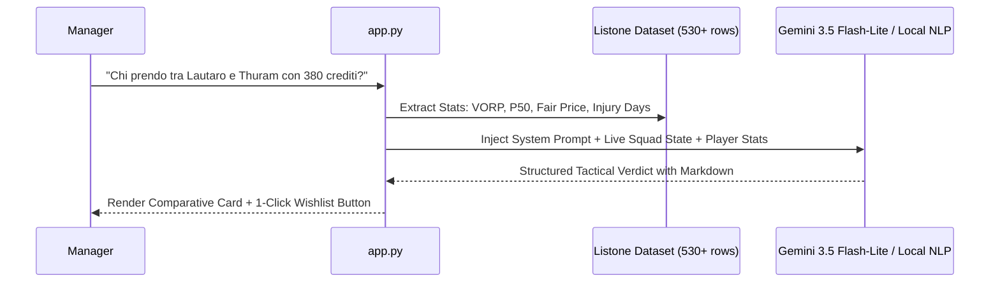

# Live Auction Command Center & AI Tactical Copilot
### *Because Having an ML Model Means Nothing if You Panic at 2:00 AM on a 4th-Tier Striker*

---

## 1. The Anatomy of Draft Night Disaster

Building probabilistic quantile regression models ($P_{10}, P_{50}, P_{90}$) and solving Mixed-Integer Linear Programming knapsack problems in a sterile Jupyter notebook is wonderful. But fantasy football leagues are not won in notebooks; they are won (and far more frequently lost) in chaotic living rooms filled with cold pizza, beer stains, and loud shouting.

Around hour four of a traditional 10-team auction, three predictable psychological breakdowns occur:

1. **The Anchoring Cascade**: A rival manager overspends by 35% on an opening striker. The entire room recalibrates their mental baseline, causing an inflationary panic where second-tier assets trade at superstar premiums.
2. **The Liquidity Trap**: A manager hoards 50% of their purse waiting for "value," only to discover that every remaining player is a 1-credit lottery ticket. They finish the auction with 150 unused credits and a front line composed of youth academy reserves.
3. **Medical Amnesia**: Bidding wars erupt over names with brand recognition whose orthopedic records resemble an advanced traumatology textbook.

The **Live Auction Command Center (`app.py`)** was developed as a real-time tactical spinoff to enforce algorithmic discipline under battle conditions.

---

## 2. Command Center Architecture & Multiplayer Protocol

The application runs as a lightweight, reactive web server engineered for instantaneous response times and zero-latency auction tracking.

### 2.1. Dual-Tier State Isolation
- **Global Auction State (`auction_state.json`)**: Tracks confirmed assignments, remaining budgets, max single-bid capacities ($B_{rem} - S_{free} + 1$), and transaction undo history across all 10 league franchises.
- **Client-Side Profile Isolation (`localStorage`)**: Tactical target wishlists, custom maximum bid ceilings ($C_{max}$), and personal scout notes are stored strictly inside each manager's browser. Rivals cannot snoop on your watchlist over the local network.

### 2.2. The Admin Passkey (Battitore Gate)
To prevent accidental misclicks or rival sabotage, auction mutations (`/api/bid`, `/api/undo`, `/api/reset`) require administrative authorization (configured via `ADMIN_PASSWORD` or defaulting to `fanta2026`). Non-admin participants enjoy real-time budget synchronization and search functionality with destructive actions masked.

---

## 3. Dynamic Tactical Blueprints & Stop-Loss Boundaries

The Command Center implements 5 tactical archetypes. As assets are drafted, each blueprint dynamically recalibrates target price bounds and strict **Stop-Loss ceilings**:

$$\text{Stop-Loss Ceiling}_{i} = \text{Target Price}_{i} \times \left(1 + \delta_{role}\right)$$

Where $\delta_{role}$ represents the maximum allowed emotional tolerance (typically $\delta_A = 0.15$ for Top Strikers, $\delta_D = 0.10$ for Defenders).

| Tactical Archetype | Budget Allocation (P / D / C / A) | Strategic Rationale |
| :--- | :--- | :--- |
| **Trazione Anteriore** | $5\% \;/\; 12\% \;/\; 23\% \;/\; \mathbf{60\%}$ | Heavy capital concentration on 2 elite Strikers. Defense is populated with verified starters at baseline prices ($1-3\text{ cr}$). |
| **Modificatore di Ferro** | $7\% \;/\; \mathbf{24\%} \;/\; 24\% \;/\; 45\%$ | Exploits the Defense Modifier bonus. Acquires three high-MV defenders ($\text{MV} \ge 6.20$) to harvest $+3 / +6$ modifier points weekly. |
| **Centrocampo Dominante** | $6\% \;/\; 14\% \;/\; \mathbf{38\%} \;/\; 42\%$ | Arbitrages the goal-scoring midfielder premium. Acquires penalty-takers and attacking wingers registered as midfielders. |
| **Moneyball (High Surplus)** | $6\% \;/\; 16\% \;/\; 28\% \;/\; 50\%$ | Pure algorithmic value-investing. Strictly bids on players whose current market price is below their fair economic value ($SV > 0$). |
| **Custom Blueprint** | *User-defined per role* | Fully customizable budget allocation and per-slot credit boundaries. |

---

## 4. FantaLab AI: Grounded RAG & Tactical Guardrails

The built-in assistant is designed to prevent emotional hallucinations during bidding wars.

### 4.1. The Dual-Engine Fail-Safe
1. **Cloud Neural Engine (Google Gemini 3.5 Flash-Lite)**:
   - When configured with `GEMINI_API_KEY`, the server injects the active manager's live budget, empty slots, and listone metrics into a prompt with a sub-500ms response time.
   - Grounded strictly on verified data: zero hallucinated statistics or fabricated prices.
2. **Zero-Latency Local Quantitative Reasoner (Fallback Engine)**:
   - If offline or if API quotas are saturated, an internal analytical engine processes multi-player comparisons, squad health diagnostics, role/budget filtering, and deep-dive analytical cards with mathematical certainty.
   - **Zero Cost Guarantee**: Completely immune to unexpected billing or cloud rate-limit lockouts.

---

## 5. Live Auction UX & The Anti-Clutter Filter

- **"Solo Svincolati" Toggle**: During live auctions, visually scanning 500+ players is cognitive poison. A single click hides all assigned players, instantly narrowing the field to active targets.
- **Opacity & Assignment Tagging**: Assigned assets remain softly visible ($40\%$ opacity) with exact purchasing franchise and price badges for market inflation auditing.
- **Mobile-First Responsive Layout**: All tables, comparison grids, and quick-bid buttons feature 44px+ touch targets and native scrolling containers for seamless tablet and smartphone operation.
