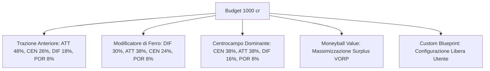

# Model Interpretability & Quantitative Framework — fanta-lab

## Executive Summary

`fanta-lab` is an algorithmic decision engine and live draft software designed for modern Serie A fantasy football (*Fantacalcio Classic & Mantra*). It combines empirical feature engineering, probabilistic point projections, economic auction theory (Value Over Replacement Player), non-linear pricing curves, and real-time tactical optimization.

This document details the mathematical formulations, feature pipelines, heuristic weights, and decision rules governing every output of the model.

---

## 1. Probabilistic Points Forecasting ($P_{10}, P_{50}, P_{90}$)

Rather than predicting a single deterministic score, `fanta-lab` models fantasy point distributions over 38 matchdays through a probabilistic quantile framework:

- **$P_{50}$ (Expected Median Yield)**: The most likely total point return under standard minutes.
- **$P_{10}$ (Statistical Floor)**: The worst-case output scenario (e.g., recurring minor injuries, rotation loss, disciplinary cards).
- **$P_{90}$ (Ceiling / Match-Winner Potential)**: The 90th-percentile upside scenario (e.g., penalty taker status, overperformance in attacking output).

### Formulation:

$$\text{Predicted Pts } (P_{50}) = 38 \times \left( \text{Starts\%} \times \text{FM}_{\text{starter}} + (1 - \text{Starts\%}) \times \text{FM}_{\text{sub}} \right) \times \left(1.0 - \text{Injury Factor}\right)$$

Where:
- $\text{Starts\%} = \frac{\text{Projected Starts}}{38}$, derived from verified 2026/27 pre-season hierarchies (`is_starter_2627` and transfer market depth).
- $\text{FM}_{\text{starter}} = \text{Base Rating} + 3 \cdot xG_{90} + 1 \cdot xA_{90} - 0.2 \cdot \text{Malus}_{90}$.

```
Expected Point Spread:
[ P10 (Floor) ] <====== (Volatilità / Rischio) ======> [ P50 (Expected) ] <==========> [ P90 (Upside) ]
```

---

## 2. Value Over Replacement Player (VORP)

Raw fantasy points are economically distorted across roles (e.g., 200 points from a Defender is exponentially scarcer than 200 points from an Attacker). `fanta-lab` standardizes productivity using **VORP**:

$$\text{VORP}_i = \max\left(0, P_{50, i} - \text{Baseline Points}_{\text{Role}(i)}\right)$$

### Dynamic Baseline Definitions (10-Team League / 29-Player Roster):

For a standard league with 10 managers ($4P, 9D, 9C, 7A$ per squad):

| Role | Total Drafted | Starting Tier | Baseline Replacement Rank | Baseline Definition ($B_r$) |
|:---:|:---:|:---:|:---:|:---|
| **Portieri (P)** | 40 | 10 starters | **Rank #10** | Lowest expected yield among 1st-choice starting goalkeepers. |
| **Difensori (D)** | 90 | 40 starters | **Rank #45** | Median yield of a low-cost, guaranteed 6.0 starter (e.g. 5.75 FM). |
| **Centrocampisti (C)** | 90 | 40 starters | **Rank #45** | Median yield of a regular starter with low bonus volume. |
| **Attaccanti (A)** | 70 | 30 starters | **Rank #30** | Median yield of a 3rd-choice forward / secondary striker. |

### Strategic Purpose of VORP:
1. **Role Scarcity Calibration**: Identifies that a top attacking wing-back (e.g., Dimarco, Bastoni) provides higher marginal value than an average mid-table starting forward.
2. **Replacement Level**: Any player below the baseline receives a $\text{VORP} = 0$, mapping directly to a 1-credit auction floor.

---

## 3. Fair Price Curve ($FVM_{1000}$ & $FVM_{500}$)

The Fair Value Model ($FVM$) maps VORP into optimal auction credits based on the league's total credit liquidity:

$$\text{Total Available Liquidity} = N_{\text{teams}} \times \text{Budget}_{\text{team}} - \sum (\text{Reserve 1 cr for minimum slots})$$

$$\text{Fair Price}_i = 1 + \left(\frac{\text{VORP}_i^{\alpha}}{\sum_{j \in \text{Draftable}} \text{VORP}_j^{\alpha}}\right) \times \text{Spendable Pool}_{\text{Role}}$$

Where:
- $\alpha = 1.18$ represents the non-linear premium curve: elite top-tier assets ($P1$) command an exponential price multiplier due to roster slot constraints.
- $FVM_{1000}$ corresponds to a standard 1,000-credit budget.
- $FVM_{500}$ corresponds to a standard 500-credit budget ($\approx FVM_{1000} \div 2$).

### Surplus Value Metric:

$$\text{Surplus Value (cr)} = FVM_{1000} - \text{Market Cost (Quotazione / Prezzo Reale)}$$

A positive Surplus Value indicates an undervalued target (Moneyball target); a negative value denotes market inflation (players overhyped relative to expected statistical yield).

---

## 4. Tactical Blueprint Optimization

`fanta-lab` includes 5 strategic resource allocation archetypes:



### Stop-Loss Risk Controls:
Each slot within a tactical ladder defines:
1. **Target Budget**: Ideal allocation credit target.
2. **Tetto Stop-Loss**: Hard ceiling cap. If bidding exceeds this limit, the system alerts the manager to pivot to alternative targets in the same cluster.
3. **Cluster Fallbacks**: Candidate list sorted by VORP and status (`is_starter_2627`), allowing free out-of-order drafting during live call-outs.

---

## 5. Medical Risk & Durability Penalty

The injury malus parametrically cuts a player's valuation to prevent auction disasters:

$$\text{Days Penalty} = \min\left(\frac{\text{Days Injured (3 Seasons)}}{180}, 1.0\right)$$

$$\text{Severity Penalty} = \begin{cases} 0.30 & \text{if Single Absence} \ge 60 \text{ days} \\ 0.00 & \text{otherwise} \end{cases}$$

$$\text{Durability Malus} = \min\left(0.70 \cdot \text{Days Penalty} + \text{Severity Penalty}, 1.0\right)$$

$$\text{Adjusted Score} = \text{Score}_{\text{base}} \times \left(1.0 - 0.15 \times \text{Durability Malus}\right)$$

---

## 6. Real-Time NLP Tactical Engine (FantaLab AI)

The built-in query system translates manager questions into data filters:

| Query Type | Pattern | Algorithm & Output |
|---|---|---|
| **Head-to-Head Comparison** | `Malen vs Lautaro`, `Confronta X e Y` | Computes Delta VORP, floor/ceiling spread, historical durability, and recommends the superior efficiency asset. |
| **Deep-Dive Profile** | `Analizza Dimarco`, `Scheda Buongiorno` | Pulls complete quantile distribution, tactical role, surplus value, and starter confidence. |
| **Role & Budget Constraints** | `Centrocampisti sotto 40 cr`, `Scommesse a 1 cr` | Filters unassigned players by role and price ceiling, ranking strictly by VORP surplus. |
| **Modificatore Targets** | `Top difensori per modificatore` | Ranks defenders by Expected Base Rating ($MV \ge 6.20$) and confirmed starter index. |
