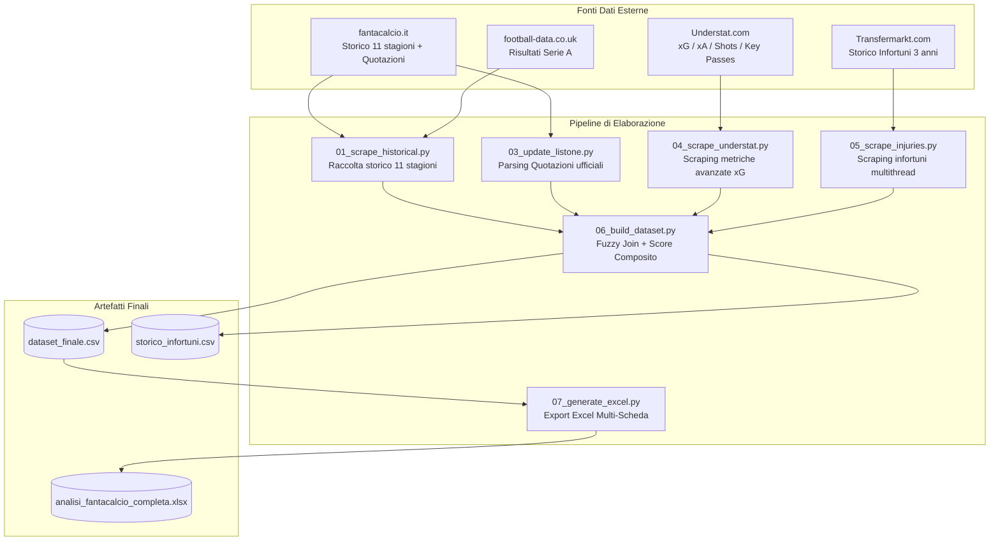

# Architettura della Pipeline — fanta-lab

fanta-lab e' un framework modulare per l'estrazione, l'aggregazione e l'analisi quantitativa dei calciatori di Serie A in ottica asta Fantacalcio (Classic e Mantra).

---

## Flusso dei Dati



---

## Fasi della Pipeline

### Fase 1: Raccolta Dati Storici (pipeline/01_scrape_historical.py)
- **Obiettivo**: Raccogliere le statistiche di tutti i calciatori per le ultime 11 stagioni di Serie A da `fantacalcio.it`.
- **Output**:
  - `data/storico_giocatori_raw.csv`: ~5.000 righe (giocatore per stagione).
  - `data/storico_giocatori_aggregato.csv`: Medie voto ponderate (3y con pesi 3-2-1), trend di rendimento, volatilita' (std), disponibilita' percentuale e tassi bonus/malus per presenza.
  - `data/storico_squadre_aggregato.csv`: Indici offensivi e difensivi delle squadre.

### Fase 2: Aggiornamento Listone (pipeline/03_update_listone.py)
- **Obiettivo**: Leggere il file ufficiale delle quotazioni (`Quotazioni_Fantacalcio_Stagione_XXXX_XX.xlsx`), separare i calciatori attivi dai ceduti e preparare la struttura base del listone.
- **Output**: DataFrame in memoria con 530+ giocatori attivi, ruoli Classic/Mantra, quotazioni attuali e FVM.

### Fase 2b: Scraping Understat (pipeline/04_scrape_understat.py)
- **Obiettivo**: Interrogare l'API di Understat per estrarre Expected Goals (xG), Expected Assists (xA), non-penalty xG (npxG) e tiri per 90 minuti per le ultime 4 stagioni.
- **Output**:
  - `data/understat_raw.csv`
  - `data/understat_aggregato.csv` (medie ponderate 3y e metriche p90).

### Fase 3: Scraping Infortuni Transfermarkt (pipeline/05_scrape_injuries.py)
- **Obiettivo**: Scraping asincrono multithread su Transfermarkt per ogni calciatore del listone, con verifica incrociata su nome e squadra di appartenenza.
- **Output**:
  - `data/tm_injuries_cache.json` (cache locale per evitare ri-scraping).
  - Conteggio giorni di stop, numero infortuni, flag infortunio grave (>60 giorni) e calcolo malus fragilita'.

### Fase 4: Build Dataset Finale (pipeline/06_build_dataset.py)
- **Obiettivo**: Eseguire il merge multi-sorgente tramite algoritmi di fuzzy matching normalizzato (gestione accenti, varianti di nome, abbreviazioni) e calcolare lo **Score Composito** pesato e il malus infortuni.
- **Output**:
  - `data/dataset_finale.csv` (dataset unificato a 37 colonne).
  - `data/storico_infortuni.csv` (report dettagliato fragilita' fisica).

### Fase 5: Generazione Excel Multi-Scheda (pipeline/07_generate_excel.py)
- **Obiettivo**: Creare un foglio di calcolo Excel con formattazione condizionale, larghezza colonne adattiva, palette di colori per ruolo e scheda "LEGENDA COLONNE" per l'asta.
- **Output**:
  - `data/analisi_fantacalcio_completa.xlsx` (Schede: Listone Completo, Portieri, Difensori, Centrocampisti, Attaccanti, Legenda).

---

## Esecuzione tramite CLI

```bash
# Esegui tutta la pipeline
python run_pipeline.py

# Esegui uno step specifico
python run_pipeline.py --step 6
python run_pipeline.py --step 7

# Esegui a partire da un determinato step
python run_pipeline.py --from 4
```
